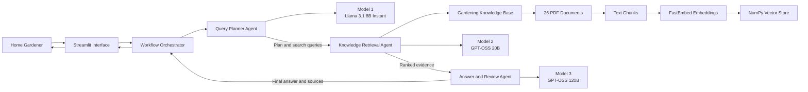
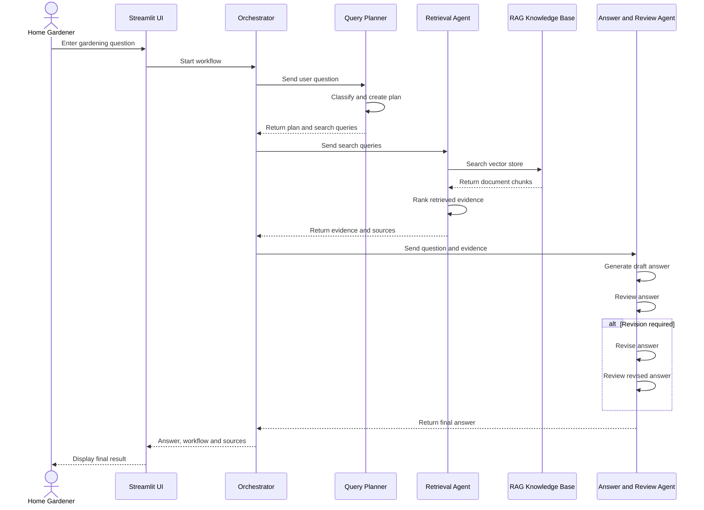

# HomeGarden LK

## Agentic AI Home Gardening Assistant for Sri Lankan Households

HomeGarden LK is an Agentic AI application developed to help Sri Lankan households find simple and document-supported home-gardening information.

The system searches a domain-specific collection of gardening documents and uses specialised AI agents to plan, retrieve, generate and review the final answer.

**Student Name:** Wathsala Kithulgala  
**Index Number:** ITBIN-2312-0025  
**Module:** IT41043 – Intelligent Systems (Agentic AI)  
**Documents:** 26 gardening documents  
**GitHub Repository:** [Open GitHub Repository](https://github.com/wathsala2001/homegarden-lk)  
**Live Application:** [Open HomeGarden LK Application](https://homegarden-lk-wathsala.streamlit.app)  
**Retrieval Success Rate:** 80.0%

---

## Problem

Home gardeners often need information about watering, planting, fertiliser, soil preparation, pest control and plant diseases.

This information may be spread across many different gardening documents. It can take a user a long time to find the correct document and page.

HomeGarden LK supports this process by:

- Understanding the gardening question
- Planning suitable searches
- Retrieving relevant document sections
- Ranking the evidence
- Creating a simple answer
- Checking the answer before showing it
- Displaying the document sources and page numbers

The system is not designed as a general-purpose chatbot. It mainly answers questions using the selected gardening knowledge base.

---

## Main Features

- Domain-specific home-gardening knowledge base
- 26 gardening PDF documents
- Three communicating AI agents
- Three different AI model roles
- Gardening-question classification
- Planning and task decomposition
- Semantic document retrieval
- AI-based evidence ranking
- Source-supported answer generation
- Reflection and answer revision
- Structured agent-to-agent communication
- Document names and page numbers
- Streamlit user interface
- Retrieval evaluation
- Live cloud deployment

---

## System Architecture



The system architecture is also available in:

```text
diagrams/system_architecture.md
```

---

## AI Agents

### 1. Query Planner Agent

The Query Planner Agent receives the user’s gardening question.

It performs the following tasks:

- Identifies the plant
- Classifies the question type
- Selects the correct gardening area
- Creates a search plan
- Creates suitable search queries

Example question types include:

- Planting
- Watering
- Fertiliser
- Soil preparation
- Pest control
- Plant diseases
- Composting
- Harvesting

The faster model is used because classification and short planning do not require the strongest model.

---

### 2. Knowledge Retrieval Agent

The Knowledge Retrieval Agent searches the gardening knowledge base.

It performs the following tasks:

- Converts search queries into embeddings
- Searches the NumPy vector store
- Retrieves related document chunks
- Removes repeated results
- Uses Model 2 to rank the evidence
- Selects the most useful document information
- Records document names and page numbers

This agent follows the ReAct and Tool-Use pattern because it performs a search action and observes the retrieved results.

---

### 3. Answer and Review Agent

The Answer and Review Agent uses the strongest model.

It performs three main tasks:

1. Generates the first answer using retrieved evidence
2. Reviews the answer against the evidence
3. Revises the answer when a problem is found

The review checks whether the answer:

- Uses retrieved evidence
- Answers the user’s question
- Avoids unsupported claims
- Uses simple English
- Includes safety advice when required
- Includes document sources

---

## Orchestrator

The Orchestrator controls the complete workflow.

It runs the agents in this order:

1. Query Planner Agent
2. Knowledge Retrieval Agent
3. Answer and Review Agent

It also:

- Creates the initial structured state
- Passes information between the agents
- Stops the workflow when an error occurs
- Records the workflow status
- Returns the final answer to the Streamlit interface

---

## Agentic Design Patterns

### 1. Routing Pattern

The Query Planner Agent classifies the gardening question.

For example:

```text
How often should I water tomato plants?
```

The system identifies:

```text
Plant: Tomato
Question type: Watering
```

---

### 2. Planning and Task-Decomposition Pattern

The Query Planner Agent divides the question into smaller tasks.

Example:

```text
1. Identify the plant.
2. Identify the gardening problem.
3. Create search queries.
4. Retrieve document evidence.
5. Prepare and review the answer.
```

---

### 3. ReAct and Tool-Use Pattern

The Knowledge Retrieval Agent uses the RAG search system as a tool.

The process is:

```text
Reason → Search → Observe results → Rank evidence
```

The agent can compare retrieved results before passing them to the final agent.

---

### 4. Reflection Pattern

The Answer and Review Agent checks its first answer.

If the answer is unsupported, unclear or incomplete, the system asks Model 3 to revise it.

The final workflow status can be:

```text
answer_complete
answer_needs_revision
insufficient_evidence
error
```
## Agentic Pattern Code Locations

The following table shows where each Agentic AI pattern is implemented in the project.

| Pattern | File and function | Purpose |
|---|---|---|
| Routing | `agents/query_planner_agent.py` — `run_ai_planner()` and `classify_question()` | Identifies the plant and classifies the gardening question |
| Planning and task decomposition | `agents/query_planner_agent.py` — `run_ai_planner()` and `create_plan()` | Creates search queries and divides the question into smaller tasks |
| ReAct and tool use | `agents/retrieval_agent.py` — `run_retrieval_agent()`, `use_retrieval_tool()` and `create_fallback_query()` | Searches the vector store, observes the retrieved results and performs another search when evidence is insufficient |
| Reflection and self-checking | `agents/answer_review_agent.py` — `reflect_on_answer()`, `revise_answer()` and `run_answer_review_agent()` | Reviews the draft answer and revises it when a problem is identified |
| Orchestration | `core/orchestrator.py` — `run_garden_workflow()` | Controls the order of the three agents and passes the shared state between them |

The Orchestrator first runs the Query Planner Agent, then the Knowledge Retrieval Agent and finally the Answer and Review Agent.
---

## Agent Communication Protocol

The agents communicate through a structured shared state.

The structured state contains:

- Request ID
- User question
- Plant
- Question type
- Language
- Search plan
- Search queries
- Retrieved chunks
- Ranked evidence
- Draft answer
- Reflection result
- Final answer
- Sources
- Workflow status
- Error information

Example:

```json
{
  "request_id": "REQ-12AB34CD",
  "user_question": "How often should I water tomato plants?",
  "plant": "tomato",
  "question_type": "watering",
  "language": "English",
  "plan": [
    "Identify the watering requirement",
    "Search the gardening knowledge base",
    "Rank the retrieved evidence",
    "Prepare and review the answer"
  ],
  "search_queries": [
    "tomato plant watering frequency",
    "watering tomatoes in home gardens"
  ],
  "retrieved_chunks": [],
  "ranked_evidence": [],
  "draft_answer": "",
  "reflection": {
    "supported_by_sources": false,
    "answers_question": false,
    "has_sources": false,
    "needs_revision": false,
    "comments": ""
  },
  "final_answer": "",
  "sources": [],
  "status": "created",
  "error": null
}
```

---

## Agent Communication Sequence



The communication sequence is also available in:

```text
diagrams/agent_communication.md
```

---

## Model Selection Strategy

Three Groq models are assigned to different tasks. Each model was selected according to task difficulty, response speed, cost, context window and reasoning ability.

| Sub-task | Model and provider | Speed | Cost per 1M tokens | Context window | Reasoning quality | Reason for selection |
|---|---|---:|---:|---:|---|---|
| Routing and planning | `llama-3.1-8b-instant` — Groq | Approximately 560 tokens/second | $0.05 input / $0.08 output | 131,072 tokens | Basic to medium | Fast and inexpensive for plant identification, question classification and short planning |
| Evidence ranking | `openai/gpt-oss-20b` — Groq | Approximately 1,000 tokens/second | $0.075 input / $0.30 output | 131,072 tokens | Medium | Fast enough to compare and rank several retrieved gardening chunks |
| Answer generation and reflection | `openai/gpt-oss-120b` — Groq | Approximately 500 tokens/second | $0.15 input / $0.60 output | 131,072 tokens | Strong | Better for producing source-supported answers, checking unsupported claims and revising the answer |

The faster and cheaper model is used for simple routing and planning. The medium model is used for evidence ranking. The strongest model is used for final answer generation, reflection and revision.

This design avoids using the strongest and most expensive model for every task.
---

## RAG Pipeline

The Retrieval-Augmented Generation pipeline follows these steps:

1. Load the gardening PDF documents.
2. Extract readable text from each document.
3. Divide the text into smaller overlapping chunks.
4. Add source names and page numbers as metadata.
5. Generate embeddings for each text chunk.
6. Store the embeddings in a NumPy vector store.
7. Convert the user’s search query into an embedding.
8. Compare the query with the stored vectors.
9. Retrieve the most similar document chunks.
10. Use Model 2 to rank the evidence.
11. Send the strongest evidence to Model 3.
12. Generate and review the final answer.

---

## Knowledge Base

- **Domain:** Home gardening
- **Target users:** Sri Lankan households and beginner gardeners
- **Number of documents:** 26
- **Document type:** Gardening PDF documents
- **Main areas:**
  - Home-gardening basics
  - Soil preparation
  - Compost preparation
  - Tomato cultivation
  - Brinjal cultivation
  - Okra cultivation
  - Cucumber cultivation
  - Bean cultivation
  - Container gardening
  - Water management
  - Vegetable pests
  - Plant diseases
  - Seed selection
  - Nursery management
  - Urban home gardening
  - Leafy vegetable cultivation

---

## Document Processing

The PDF processing component:

- Reads PDF files using PyPDF
- Extracts text page by page
- Removes empty pages
- Stores the document filename
- Stores the page number
- Divides long text into smaller chunks
- Preserves overlap between neighbouring chunks

The overlap helps preserve information located near the boundary of two chunks.

---

## Embedding Model

The system uses:

```text
BAAI/bge-small-en-v1.5
```

The model is loaded using FastEmbed.

It converts:

- Gardening document chunks
- User search queries

into numerical semantic vectors.

---
## Chunking Strategy

The gardening documents are divided into fixed-size overlapping text chunks.

- **Chunk size:** 800 characters
- **Chunk overlap:** 120 characters
- **Metadata stored:** document filename, page number, chunk number and chunk ID

The overlap helps preserve information that appears near the boundary between two chunks. Without overlap, an important sentence may be separated from its related information.

I selected this fixed-size chunking method because it was simple to implement, test and explain within the available project time. The filename and page number are stored with each chunk so the final application can display its information sources.

---

## Vector Store

The project uses a NumPy vector store.

The stored files are:

```text
data/vector_store/embeddings.npy
data/vector_store/metadata.json
```

`embeddings.npy` contains the numerical vectors.

`metadata.json` contains:

- Document names
- Page numbers
- Original chunk text
- Other retrieval information

---

## Retrieval Evaluation

The retrieval system was tested using five sample home-gardening questions.

The purpose of this evaluation was to check whether the RAG system could retrieve document chunks that were relevant to each question.

The evaluation questions covered:

- Tomato watering
- Chilli fertiliser
- Compost preparation
- Natural pest control
- Brinjal leaf problems

### Evaluation Results

```text
Total questions: 5
Relevant retrievals: 4
Unsuccessful retrievals: 1
Retrieval success rate: 80.0%
```

The detailed evaluation files are available in:

```text
evaluation/retrieval_questions.json
evaluation/retrieval_results.csv
evaluation/retrieval_summary.md
```

### Evaluation Discussion

The retrieval system returned relevant gardening information for four out of five test questions. Therefore, the final retrieval success rate was **80.0%**.

This result shows that the knowledge base can retrieve useful information for most common home-gardening questions.

One of the five evaluation questions did not retrieve sufficiently relevant context. A possible reason is that the wording of the question did not closely match the terminology used in the gardening documents.

Semantic retrieval may return partly related information when:

- The question is too broad
- The user uses different words from the documents
- The knowledge base does not contain enough information about the topic
- Important information is divided across different document chunks
- The similarity between the question and the stored document chunks is low

The retrieval process could be improved by:

- Adding gardening synonyms and query expansion
- Adding more Sri Lankan gardening documents
- Improving document metadata
- Testing different chunk sizes and overlap values
- Combining keyword search with semantic search
- Increasing the number of evaluation questions
- Adjusting the retrieval similarity threshold

The **80.0% result is reported honestly** instead of being changed to 100%. It shows that the system works for most tested questions while still having a clear area for future improvement.

---

## Project Structure

```text
homegarden-lk/
│
├── agents/
│   ├── __init__.py
│   ├── query_planner_agent.py
│   ├── retrieval_agent.py
│   └── answer_review_agent.py
│
├── core/
│   ├── __init__.py
│   ├── orchestrator.py
│   ├── prompts.py
│   └── state.py
│
├── data/
│   ├── raw_documents/
│   └── vector_store/
│       ├── embeddings.npy
│       └── metadata.json
│
├── diagrams/
│   ├── system_architecture.md
│   └── agent_communication.md
│
├── evaluation/
│   ├── retrieval_questions.json
│   ├── evaluate_retrieval.py
│   ├── retrieval_results.csv
│   └── retrieval_summary.md
│
├── models/
│   ├── __init__.py
│   └── model_manager.py
│
├── rag/
│   ├── __init__.py
│   ├── document_loader.py
│   ├── text_chunker.py
│   ├── embedding_manager.py
│   ├── vector_store.py
│   └── retriever.py
│
├── scripts/
│   ├── __init__.py
│   └── build_index.py
│
├── tests/
├── utils/
├── .env.example
├── .gitignore
├── app.py
├── requirements.txt
└── README.md
```

---

## Local Installation

### 1. Clone the repository

```bash
git clone https://github.com/wathsala2001/homegarden-lk.git
cd homegarden-lk
```

### 2. Create a virtual environment

```bash
python -m venv venv
```

### 3. Activate it on Windows

```powershell
venv\Scripts\Activate.ps1
```

### 4. Install dependencies

```bash
pip install -r requirements.txt
```

### 5. Create the environment file

Create a `.env` file:

```env
GROQ_API_KEY=your_private_groq_api_key
ROUTER_MODEL=llama-3.1-8b-instant
RERANK_MODEL=openai/gpt-oss-20b
FINAL_MODEL=openai/gpt-oss-120b
```

Never upload the real `.env` file to GitHub.

### 6. Build the vector index

```bash
python scripts/build_index.py
```

### 7. Run the Streamlit application

```bash
python -m streamlit run app.py
```

---

## Live Application

Open the live HomeGarden LK application:

```text
https://homegarden-lk-wathsala.streamlit.app
```

---

## Deployment

The application is deployed using Streamlit Community Cloud.

- **Repository:** `wathsala2001/homegarden-lk`
- **Deployment branch:** `main`
- **Main file:** `app.py`
- **Python version:** `3.12`
- **Secret management:** Streamlit Community Cloud Secrets
- **Public application:** `https://homegarden-lk-wathsala.streamlit.app`

---

## Error Handling

The system handles:

- Empty gardening questions
- Missing Groq API key
- Invalid API configuration
- Missing vector-store files
- No retrieved gardening evidence
- Invalid JSON reflection response
- Model API errors
- Retrieval errors
- General agent workflow failures

When an error occurs, the structured state records:

```json
{
  "status": "error",
  "error": "Readable error description"
}
```

---

## Known Limitations

- The answer quality depends on the selected gardening documents.
- Some scanned PDF pages may not provide readable text.
- The system mainly supports English questions.
- Retrieval success is currently 80.0%.
- Some unclear questions may retrieve partly related information.
- An internet connection is required for the Groq models.
- API availability and rate limits can affect response time.
- The system does not replace professional agricultural advice.
- The current system does not analyse plant images.
- Weather information is not connected to the current version.

---

## Future Improvements

- Add more Sri Lankan gardening documents
- Support Sinhala and Tamil questions
- Improve retrieval for unclear questions
- Add local weather information
- Add image-based plant disease identification
- Increase the number of evaluation questions
- Improve document metadata
- Add user feedback for answer quality

---

## External Tools and Libraries

- Python
- Streamlit
- Groq API
- FastEmbed
- BAAI embedding model
- NumPy
- Pandas
- PyPDF
- Python-dotenv
- Git
- GitHub
- Streamlit Community Cloud
- Visual Studio Code

---

## Academic Integrity Declaration

This project was developed for the IT41043 Intelligent Systems Agentic AI assignment.

The external libraries, AI models, embedding model and deployment tools used in the project are disclosed in this README.

I am responsible for understanding, explaining, testing and demonstrating the complete implementation during the project evaluation.